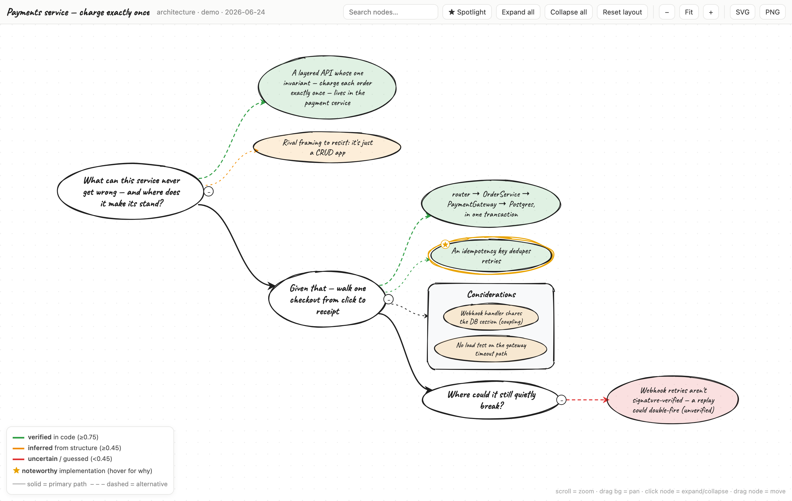
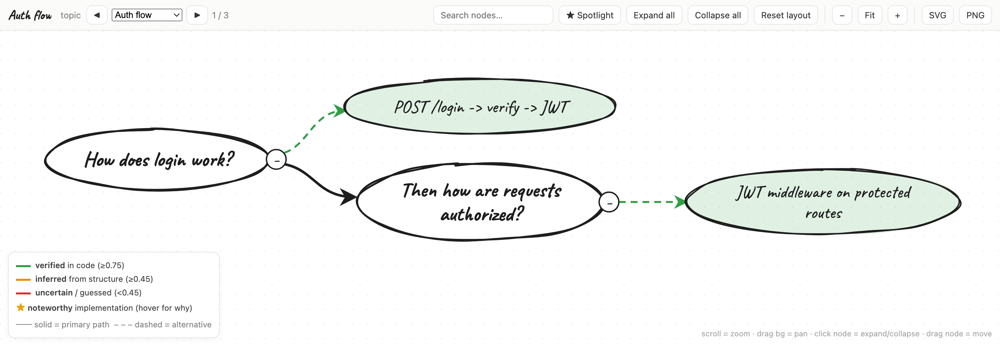

# mmap — interactive hand-drawn codebase mind maps

`/mmap` is a Claude Code **skill** that analyzes the current repo and opens a self-contained,
**offline**, interactive **hand-drawn** mind map. It's built for brownfield / AI-generated codebases
that are hard to follow: it tells the architecture as a **story** — questions chained on a solid
spine, answers branching off as dashed, confidence-colored lines — grounded in real `path:line`
evidence and colored by how verified each claim is.

- 🟢 verified in code · 🟡 inferred from structure · 🔴 uncertain/guessed (configurable thresholds)
- ⭐ gold-starred **noteworthy implementations** (clever / elegant / efficient), with a Spotlight toggle
- Interactions: expand/collapse · pan/zoom · drag · search · PNG/SVG export
- Fully offline and self-contained: one HTML file, no network needed to view it



> Above: `/mmap architecture` on a small payments service. The **solid spine** is a chain of
> questions; **dashed branches** are answers colored by confidence; the **⭐** marks a noteworthy
> implementation. (Illustrative demo — not real code.)

## Usage

In any project (with the skill installed), run:

```
/mmap architecture      # whole-system overview, told as a story
/mmap decisions         # the design decisions, the alternatives, a verdict each
/mmap tech              # technology/stack usage across the repo, and where each is used
/mmap data              # the data model: entities/tables and how they relate
/mmap onboarding        # a newcomer's guide: how to run it, first files to read, glossary
/mmap deps              # internal module dependency graph: what imports what, cycles
/mmap risks             # code health: test gaps, TODO/FIXME debt, complexity/smell hotspots
/mmap api               # the public surface: HTTP routes / CLI commands / exported API
/mmap glossary          # the domain vocabulary: recurring terms and where each is defined
/mmap flows             # auto-discover ALL major flows → one HTML with a flow navigator
/mmap the auth flow     # trace any single feature/flow end to end
/mmap                   # asks which one
```

Maps are written to a `.mindmap/` folder in whatever repo you run it on (gitignored here).

**Multiple maps in one file.** `/mmap flows` (or asking for "everything in one file") emits a
**bundle** — several maps in a single self-contained HTML with a navigator (◀ ▶ buttons, a dropdown,
and ← → arrow keys) to jump between flows:



---

## Installation

### Requirements

- **git** and **python3 ≥ 3.9** (the renderer is stdlib-only — no pip installs)
- a **web browser** to view the maps
- **Claude Code** (the skill lives under its user-level skills directory)

Nothing else: the JS libraries and font are vendored in `assets/vendor/` and inlined at render time,
so maps work with no network.

### Quick install (this machine or any new one)

```sh
git clone <THIS_REPO_URL> mmap-skill
cd mmap-skill
./install.sh            # copies the skill into ~/.claude/skills/mmap
```

Then open Claude Code in any project and run `/mmap architecture`. (Restart Claude Code if `/mmap`
doesn't appear immediately.)

Prefer a single source of truth for development? Symlink instead, so edits in the clone go live:

```sh
./install.sh link       # symlinks ~/.claude/skills/mmap -> this clone
```

### Manual install (no script)

A skill is just a folder under `~/.claude/skills/`. Copy or symlink it there:

```sh
# copy
mkdir -p ~/.claude/skills/mmap
cp -R SKILL.md scripts assets references ~/.claude/skills/mmap/

# or symlink the whole clone
ln -s "$(pwd)" ~/.claude/skills/mmap
```

`/mmap` becomes available because `SKILL.md` has `user-invocable: true` and its `name:` is `mmap`.

---

## Setting it up on other systems / other Claude accounts

A Claude Code skill is a **local filesystem** thing: it lives in `~/.claude/skills/` on the machine,
independent of which Claude.ai account is logged in. So "use it under another account" really means
"install it on that machine / for that OS user." The steps are the same everywhere:

**On any other computer (macOS / Linux / WSL):**

1. Install git + Python 3.9+ and Claude Code.
2. `git clone <THIS_REPO_URL> && cd mmap-skill && ./install.sh`
3. Run `/mmap` in a project.

**For a different OS user / Claude account on the same machine:** log in as that user (so `$HOME`
points at their home dir) and run `./install.sh` — it installs into _their_ `~/.claude/skills/mmap`.

**For another Claude-compatible agent** that reads user-level skills from a different directory
(e.g. Codex at `~/.codex/skills`): point the installer at it —

```sh
CLAUDE_SKILLS_DIR=~/.codex/skills ./install.sh
```

The skill resolves its own location at runtime (`SKILL_DIR` substitution in `SKILL.md`), so it works
from any install path.

**Updating to a new version anywhere:** `git pull` in the clone, then re-run `./install.sh`
(or, if you symlinked, the pull is already live).

---

## Repo layout

```
.
├── SKILL.md                    # the "brain": workflow, modes, story-arc + confidence rules
├── install.sh                  # one-command installer (copy or symlink)
├── scripts/
│   ├── repo_map.py             # token-lean structural skeleton extractor (~97% fewer tokens)
│   └── render_mindmap.py       # validate spec → inline assets → write self-contained HTML
├── assets/
│   ├── template.html           # the interactive renderer (with asset placeholders)
│   ├── vendor/                 # vendored libraries + font, inlined into the output (offline)
│   └── vendor-notes.md         # provenance + licenses for the bundled assets
└── references/
    ├── spec-schema.md          # the authored-spec contract + confidence rubric
    ├── story-arc.md            # how the questions form a narrative (the spine)
    ├── exploration.md          # per-stack exploration playbooks
    └── token-efficiency.md     # the lean analysis protocol + optional accelerators
```

## How it works (one paragraph)

`SKILL.md` tells Claude how to explore a repo cheaply (structure-first via `repo_map.py`, then read
only the spine files), build a flat JSON **spec** of the map (a chain of question nodes with dashed
answer branches, each cited and confidence-scored), and call `render_mindmap.py`. The renderer
validates the spec, normalizes it into a tree, inlines the vendored assets + your data into
`template.html`, and writes one self-contained HTML file it opens in your browser.

## Notes

- License: MIT (skill code). Bundled third-party assets keep their own licenses — see
  `assets/vendor-notes.md`.
